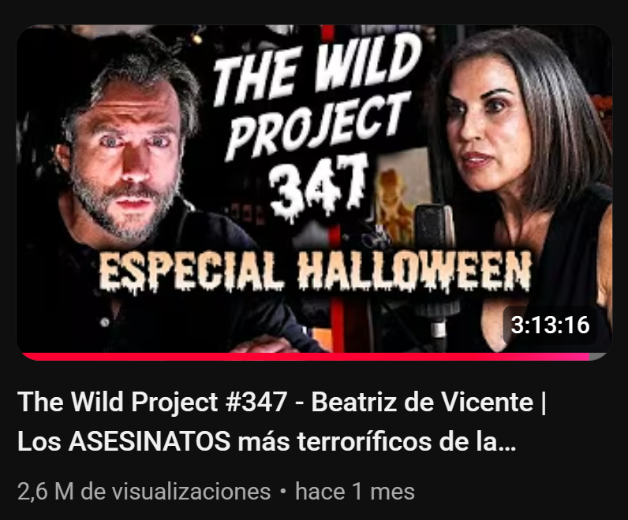
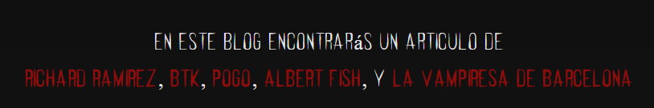
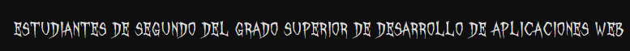
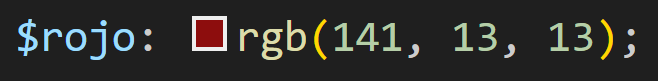
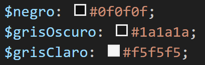
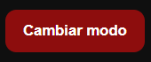

# AC5 - Diseño de Interfaces Web
## Blog: 5 casos reales de los mayores psicópatas de la historia
*Dariush Lotfi y Rohit Jaswal*  
*2n DAW*

---
### ¿Por qué hemos elegido este tema?
Poco antes de empezar el trabajo final, el podcast "The Wild Project" publicó un especial de Halloween en el que invitó a la criminóloga Beatriz de Vicente, una de las personas con más experiencia frente al mal. Este podcast nos gustó e inspiró para crear un blog sobre este tema.

---
### Tipografía

Para los títulos hemos utilizado la fuente Creepster de Google Fonts, ya que se adecúa muy bien a la temática oscura que queríamos.

Para los textos secundarios hemos utilizado 2 fuentes adicionales en su formato .ttf: 
Feral Regular

October Crow 

---
### Colores

Queríamos que el blog tuviera un diseño minimalista, por lo que optamos por colores básicos como blanco, negro y un tono distintivo.

Para este tono distintivo, utilizamos la funcionalidad de SASS de crear variables, lo que nos permitió definirlo de manera consistente en todo el blog. Finalmente, decidimos usar un rojo tipo "sangre".

Así como colores secundarios adicionales para nuestra funcionalidad "Modo Oscuro/Claro".

---

### Estructura

**index.html**

El menú principal, donde se encuentra una introducción sobre lo que encontrará el lector, la portada del blog, un menú de navegación para acceder a casos.html y a la sección "Acerca de", que se encuentra en el footer de nuestro index.html.

**casos.html**

En esta página, el usuario tendrá una tarjeta de información por cada asesino y podrá hacer "click" para acceder a su artículo.

**(nombre-asesino).html**

En los artículos hay información resumida sobre el asesino separada por diferentes apartados:
* ¿Quién es?
* Infancia
* Crímenes
* Perfil psicológico

Al final de cada artículo, hemos añadido un botón para que el usuario pueda volver a index.html.

---

### Tema oscuro y tema claro

Por defecto, el blog tiene un tema oscuro. Para permitir que el usuario cambie entre modo oscuro y modo claro, hemos utilizado JavaScript en un botón con el atributo "onclick". A través del DOM, seleccionamos el elemento body y usamos el método .toggle para añadir o quitar la clase "light-mode", aplicando así los estilos más claros.

